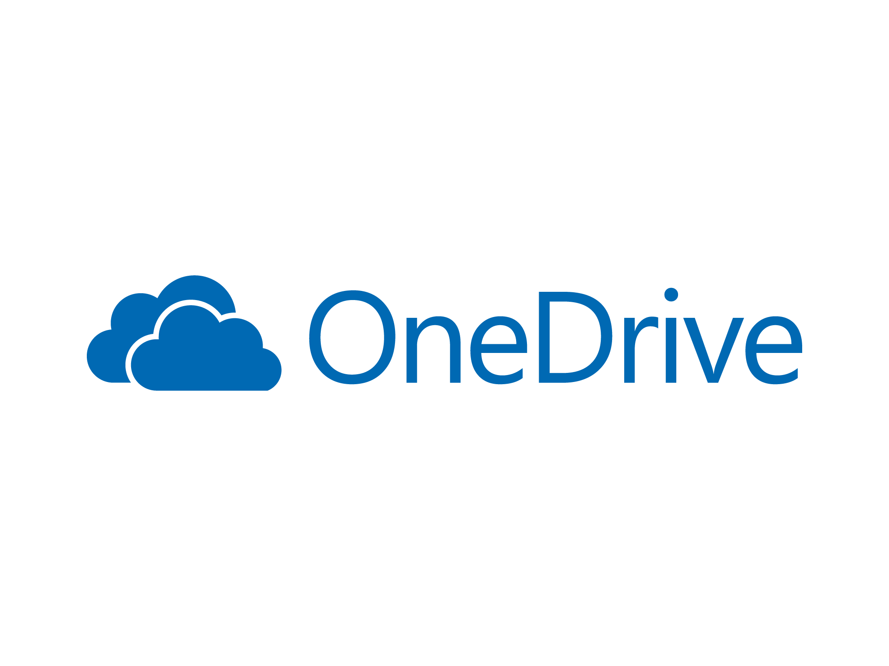
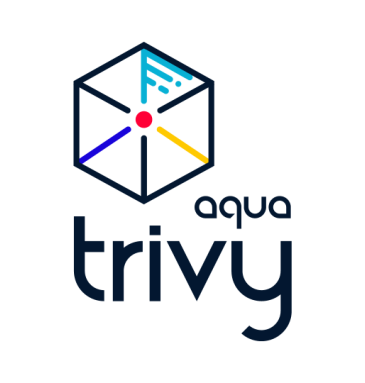

## Hi there 👋, my name is Mario

## 🙋‍♂️ About me

I'm from Brazil 🇧🇷, currently in the Eastern Standard Time Zone 🌍. I'm a huge fan of Python, IaC, observability, open-source, and writing testable software 💻.

When I'm not crushing bugs or building dreams, you can find me surfing 🏄, kite surfing 🪁🌪️, rock climbing 🧗‍♂️, training to surf/kitesurf the biggest waves in the world in Nazare 🌊, and spending time with my family and friends 🐶🤗.

## How to work with me

If you are interested what's the best way to work with me, check out [this link](https://github.com/derrix060/derrix060/blob/main/WORKING_WITH_ME.md).

## I'm currently working on

## Previous places

For more details, check out my [LinkedIn](https://www.linkedin.com/in/marioapra).

## 🔨 Open Source Contributions

[and more](https://github.com/pulls?q=author%3Aderrix060+is%3Apr+is%3Amerged+is%3Apublic).

## ✍️ I've written about

- [Managing VMs and containers with Incus](https://medium.com/@mariotapra/how-to-manage-vms-containers-with-incus-continuation-c6fe9c2171cd)
- [Incus with GPU passthrough](https://medium.com/@mariotapra/how-to-manage-vms-containers-with-incus-with-gpu-passthrough-ad5a82f0a9bc)

